# Pick6V2 Architecture Diagram

## System Overview
```
┌─────────────────────────────────────────────────────────────────────────────────┐
│                           Pick6V2 Fantasy Sports Platform                       │
│                              Multi-Mode Betting System                          │
└─────────────────────────────────────────────────────────────────────────────────┘
```

## High-Level Architecture

```mermaid
graph TD
    %% External Systems
    Client[📱 Client Apps<br/>PWA/Mobile/Web]
    OneSignal[🔔 OneSignal<br/>Push Notifications]
    RapidAPI[⚡ RapidAPI<br/>Sports Data]
    
    %% Frontend Layer
    subgraph "Frontend Layer (Static Files)"
        HTML[📄 HTML Pages<br/>login, homepage, dashboard<br/>golfSelection, rules, info]
        JS[⚙️ JavaScript Modules<br/>Vanilla JS + PWA Features]
        CSS[🎨 CSS Themes<br/>Neon/Cyberpunk Design]
    end
    
    %% API Gateway
    Express[🌐 Express Server<br/>API Gateway + Static Serving]
    
    %% Routes Layer
    subgraph "API Routes Layer"
        UserR[👤 User Routes<br/>auth, profile, notifications]
        PoolR[🏊 Pool Routes<br/>create, join, manage]
        PicksR[🎯 Picks Routes<br/>submit, retrieve, history]
        DashR[📊 Dashboard Routes<br/>NFL data, schedules]
        GolfR[⛳ Golf Routes<br/>tournaments, drafts]
        PlayoffR[🏆 Playoff Routes<br/>brackets, advancement]
        InjuryR[🏥 Injury Routes<br/>player status]
        NotifR[📨 Notification Routes<br/>push messaging]
    end
    
    %% Controllers Layer
    subgraph "Controllers Layer"
        DashC[📋 Dashboard Controller<br/>NFL API integration]
        PoolC[🔧 Pool Controller<br/>pool management logic]
        TimeC[⏰ Time Controller<br/>deadline management]
    end
    
    %% Models Layer
    subgraph "Data Models"
        PoolM[🏊 Pool Model<br/>dynamic schemas by mode<br/>Classic/Survivor/Golf]
        UserM[👤 User Model<br/>auth + preferences]
        TimeM[⏱️ TimeWindow Model<br/>betting deadlines]
        MemberM[👥 PoolMember Model<br/>mode-specific data]
    end
    
    %% Microservices Layer
    subgraph "Microservices Layer"
        Scheduler[📅 Scheduler Service<br/>Cron Jobs + Automation]
        NFLService[🏈 NFL Services<br/>Live Scores + Processing]
        GolfService[⛳ Golf Services<br/>Tournament Data]
        InjuryService[🏥 Injury Services<br/>Player Status Updates]
        ServerUtils[🔧 Server Utilities<br/>Business Logic + Points]
        WebSocket[🔄 WebSocket Service<br/>Real-time Updates]
    end
    
    %% Database
    MongoDB[(🗃️ MongoDB<br/>Connection Pool<br/>Collections: pools, userPicks,<br/>betResults, injuries, etc.)]
    
    %% External Files
    Uploads[📁 File Storage<br/>Profile Pictures<br/>Static Assets]
    
    %% Connections
    Client --> Express
    Express --> HTML
    Express --> UserR
    Express --> PoolR
    Express --> PicksR
    Express --> DashR
    Express --> GolfR
    Express --> PlayoffR
    Express --> InjuryR
    Express --> NotifR
    
    UserR --> PoolC
    DashR --> DashC
    PoolR --> PoolC
    InjuryR --> TimeC
    
    DashC --> PoolM
    PoolC --> PoolM
    PoolC --> UserM
    TimeC --> TimeM
    PoolC --> MemberM
    
    Scheduler --> NFLService
    Scheduler --> GolfService
    Scheduler --> InjuryService
    Scheduler --> ServerUtils
    
    NFLService --> MongoDB
    GolfService --> MongoDB
    InjuryService --> MongoDB
    ServerUtils --> MongoDB
    PoolM --> MongoDB
    UserM --> MongoDB
    TimeM --> MongoDB
    MemberM --> MongoDB
    
    Express --> Uploads
    OneSignal --> Client
    RapidAPI --> NFLService
    RapidAPI --> GolfService
    RapidAPI --> InjuryService
    NotifR --> OneSignal
```



## Detailed Component Interactions

### 1. User Journey Flow
```
User Login → Authentication → Pool Selection → Game Dashboard → Pick Submission → Real-time Updates
     ↓            ↓               ↓               ↓               ↓                  ↓
login.html → /users/login → homepage.html → dashboard.html → /api/savePicks → WebSocket/Polling
```

### 2. Automated Processing Pipeline
```
Scheduler (Cron) → NFL/Golf/Injury Services → Data Processing → Database Updates → User Notifications
      ↓                        ↓                      ↓                ↓                    ↓
  Time-based           External APIs        ServerUtils Logic    MongoDB Collections    OneSignal
```

### 3. Multi-Mode Pool Architecture
```
Pool Creation → Dynamic Schema Selection → Mode-Specific Logic → Member Management
      ↓                    ↓                       ↓                    ↓
Pool Controller    Classic/Survivor/Golf    Service Processing    Database Storage
```

## Technology Stack

### Frontend Stack
- **HTML5** - Semantic markup with PWA features
- **Vanilla JavaScript** - No framework dependency
- **CSS3** - Custom neon/cyberpunk theming
- **PWA Features** - Service Worker, Web App Manifest
- **OneSignal** - Push notification integration

### Backend Stack
- **Node.js** - Runtime environment
- **TypeScript** - Type-safe development
- **Express.js** - Web application framework
- **MongoDB** - NoSQL database with Mongoose ODM
- **Node-Cron** - Scheduled task automation
- **WebSocket** - Real-time communication (planned)

### External Integrations
- **RapidAPI** - NFL/Golf sports data
- **OneSignal** - Cross-platform push notifications
- **Vercel** - Deployment and hosting platform

## Data Flow Patterns

### 1. Real-time Sports Data Processing
```
RapidAPI → NFL Service → Score Processing → Multi-Pool Updates → User Point Updates → Database → Client Updates
```

### 2. User Interaction Flow
```
Client Action → API Route → Controller Logic → Model Validation → Database Operation → Response → UI Update
```

### 3. Automated Weekly Cycle
```
Tuesday: Clean Previous Week → Thursday: Archive Picks → Weekend: Process Games → Monday: Update Stats
```

## Key Architectural Patterns

### 1. **Microservices Architecture**
- Clear separation of concerns
- Independent service deployment
- Shared database with service boundaries

### 2. **MVC Pattern**
- Routes handle HTTP requests
- Controllers implement business logic
- Models define data structure and validation

### 3. **Progressive Web App (PWA)**
- Offline-first approach
- Native app-like experience
- Push notification capabilities

### 4. **Multi-Mode Design**
- Single codebase supports multiple game types
- Dynamic schema adaptation
- Shared infrastructure with mode-specific logic

### 5. **Event-Driven Processing**
- Cron-based scheduling
- Real-time data processing
- Asynchronous operations with proper error handling

## Security & Performance Features

### Security
- **bcrypt** password hashing
- **CORS** configuration for cross-origin requests
- **Input validation** at route and model levels
- **Admin-only** operations with role checking

### Performance
- **Connection pooling** for database efficiency
- **Bulk operations** for data processing
- **Caching strategies** for static assets
- **Rate limiting** for external API calls

This architecture demonstrates a well-structured, scalable fantasy sports platform capable of handling multiple game modes, real-time data processing, and automated operations while maintaining clear separation of concerns and robust error handling.